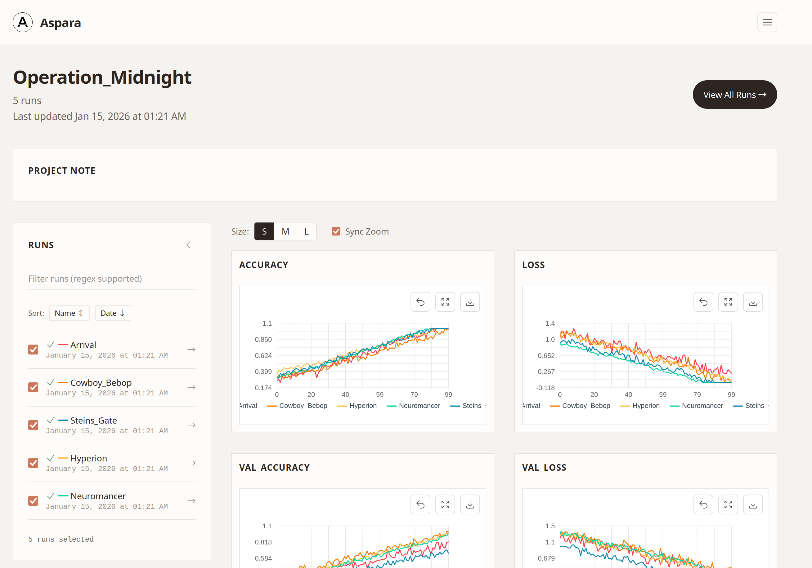

# Aspara

Aspara is a fast, open-source metrics tracker for machine learning experiments. It focuses on:

- **Fast Dashboard**: LTTB downsampling and binary data transfer via msgpack
- **Manageable Projects**: Tags and notes help you organize many experiments
- **Simple API**: Just 3 APIs: `aspara.init()`, `aspara.log()`, and `aspara.finish()`



## Try the demo
[https://prednext-aspara.hf.space/](https://prednext-aspara.hf.space/) — explore the experiment results dashboard with sample data.

## Key Features

* **Simple API**: Start tracking experiments with just a few lines of code
* **Fast Dashboard**: Browse large amounts of metrics comfortably
* **Remote Tracking**: Provides an open-source tracking server implementation

## Quick Start

```python
import aspara

# Initialize a run
aspara.init(
    project="my_project",
    name="my_first_run",
    config={"learning_rate": 0.01, "batch_size": 32},
)

# Log metrics
aspara.log({"loss": 0.5, "accuracy": 0.95})

# Finish the run
aspara.finish()
```

## Documentation

Get started with the following documentation:

- [Getting Started](getting-started.md) - Installation and basic usage
- [User Guide](user-guide/basics.md) - Detailed feature explanations
- [Dashboard](user-guide/dashboard-visualization.md) - Visualization with the dashboard
