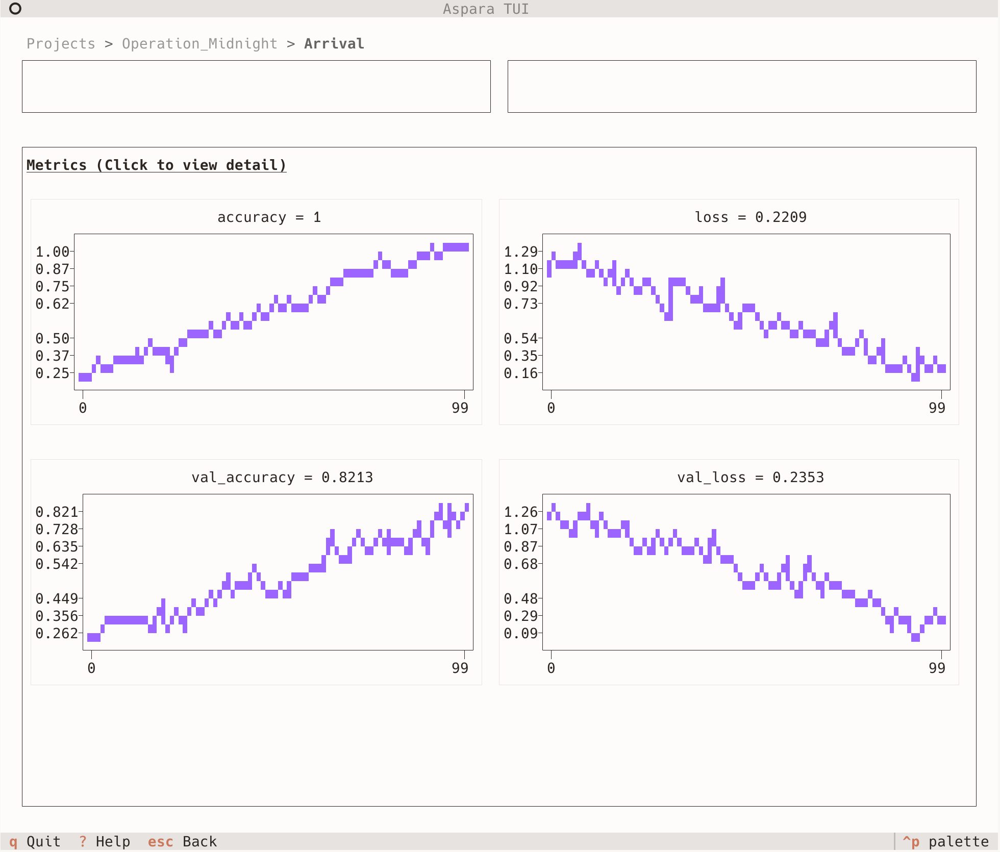

# Terminal UI (TUI)

Aspara provides a terminal-based user interface for viewing metrics directly in your terminal. The TUI offers a lightweight, keyboard-driven experience for browsing projects, runs, and metrics without needing a web browser.



## Installation

The TUI requires additional dependencies. Install them with the `tui` extra:

```bash
pip install aspara[tui]
```

Or with uv:

```bash
uv pip install aspara[tui]
```

## Starting the TUI

Launch the terminal UI with:

```bash
aspara tui
```

By default, the TUI uses the data directory configured in your settings (typically `./data`).

## Navigation

The TUI uses a hierarchical screen structure:

```
Projects → Runs → Run Detail → Metric Chart
```

- **Projects Screen**: Lists all projects in your data directory
- **Runs Screen**: Shows all runs within a selected project
- **Run Detail Screen**: Displays metrics summary and mini charts for a run
- **Metric Chart Screen**: Full-screen interactive chart for a single metric

### Keyboard Shortcuts

#### Global

| Key | Action |
|-----|--------|
| `q` | Quit application |
| `?` | Show help |
| `Backspace` | Go back to previous screen |
| `Esc` | Go back / Close modal |

#### Navigation (vim-style)

| Key | Action |
|-----|--------|
| `j` / `↓` | Move down |
| `k` / `↑` | Move up |
| `Enter` | Select / Confirm |
| `/` | Focus search input |
| `s` | Toggle sort order |

#### Chart View

| Key | Action |
|-----|--------|
| `h` / `←` | Pan left |
| `l` / `→` | Pan right |
| `+` / `=` | Zoom in |
| `-` | Zoom out |
| `r` | Reset view |
| `w` | Toggle live watch mode |

## Features

### Search and Sort

On list screens (Projects, Runs), you can:

- Press `/` to focus the search input and filter items
- Press `s` to toggle between different sort orders

### Mini Charts

The Run Detail screen shows mini sparkline charts for each metric, giving you a quick overview of metric trends without opening the full chart view.

### Interactive Chart

The Metric Chart screen provides a full-screen chart with:

- **Pan**: Use `h`/`l` or arrow keys to scroll through time
- **Zoom**: Use `+`/`-` to zoom in and out
- **Reset**: Press `r` to reset the view to show all data
- **Watch Mode**: Press `w` to enable live updates when the run is still recording

### Status Icons

Runs display status icons to indicate their state:

| Icon | Status |
|------|--------|
| ● (yellow) | Running (WIP) |
| ✓ (green) | Completed |
| ✗ (red) | Failed |
| ? (yellow) | Maybe Failed |
